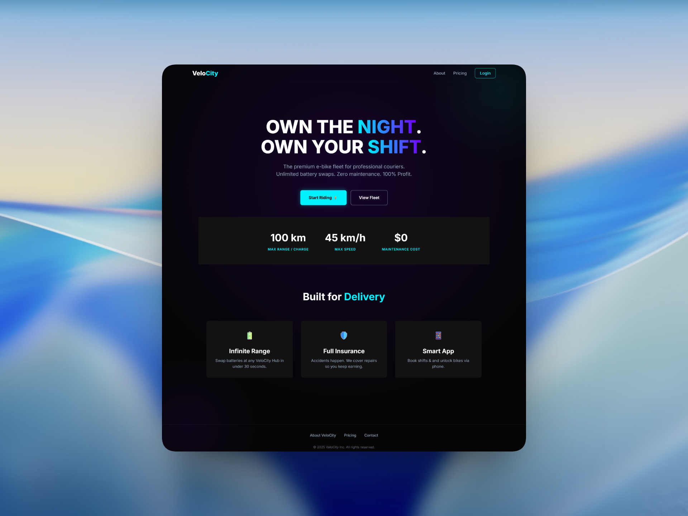
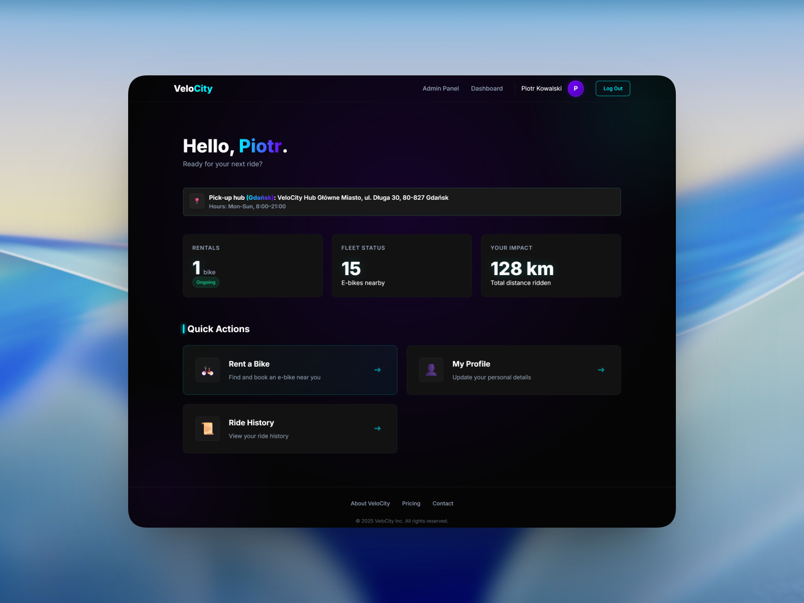
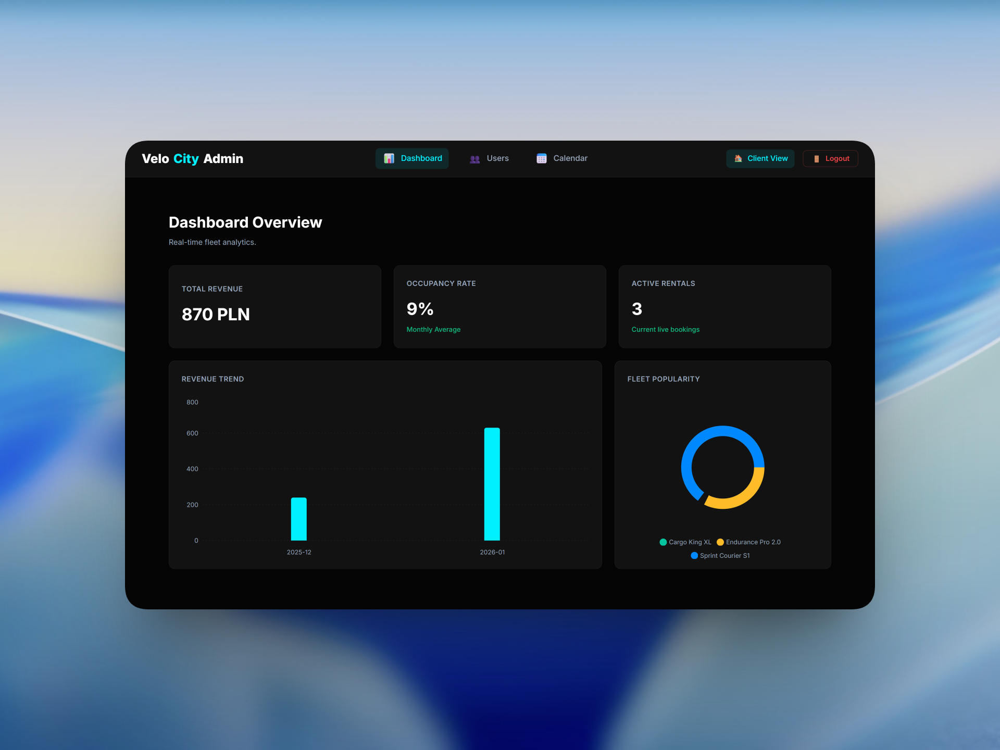
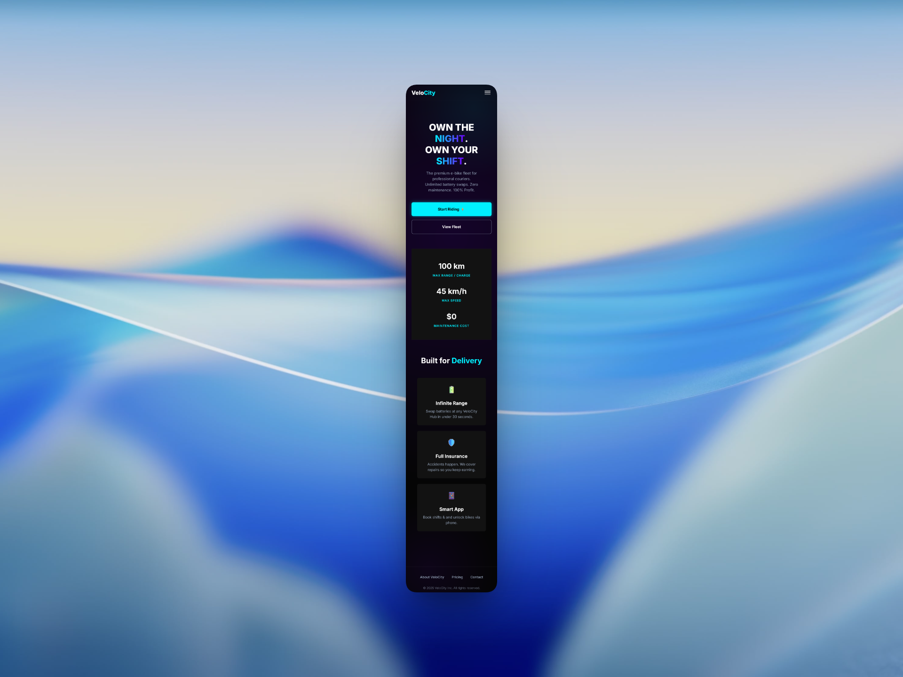

# VeloCity | Next-Gen Bike Rental Platform


> **VeloCity** is a modern, responsive Single Page Application (SPA) for managing bike fleet rentals. It serves as a dual-interface platform: a seamless booking experience for **Customers** and a robust fleet analytics dashboard for **Administrators**.

---

## Screenshots

|                        Landing Page                         |                         User Dashboard                          |
| :---------------------------------------------------------: | :-------------------------------------------------------------: |
|  |  |

|                     Admin Analytics                      |                        Mobile View                        |
| :------------------------------------------------------: | :-------------------------------------------------------: |
|  |  |

---

## Key Features

### For Clients

- **Seamless Authentication:** Secure Login/Register flow with validation and state persistence.
- **Interactive Dashboard:** View active rentals, booking history, and profile stats.
- **Profile Management:** Edit personal details with optimistic UI updates.
- **Rent a Bike:** Browse the fleet and book available bikes instantly.

### For Administrators

- **Analytics Dashboard:** Real-time charts (Recharts) visualizing revenue, occupancy rates, and fleet popularity.
- **User Management:** View user database and manage permissions.

### Technical Highlights (Under the Hood)

- **Custom Form Hook (`useForm`):** A generic, reusable hook built from scratch for form state management and validation (No external form libraries).
- **Backend Simulation:** A sophisticated `LocalStorage` adapter that mimics REST API behavior, complete with CRUD operations and relational data linking (Users ↔ Reservations).
- **Dynamic Configuration:** Icons are loaded via the **Fetch API** from a JSON configuration, simulating remote CMS behavior.
- **Optimized Rendering:** Uses `React.memo` and lazy initialization patterns to prevent unnecessary re-renders.
- **Protected Routing:** Role-based access control (RBAC) preventing unauthorized access to Admin/Client routes.

---

## Tech Stack

**Core:**

-  **React 18** (Vite)
-  **TypeScript** (Strict Mode)
-  **SCSS Modules** (BEM Methodology)

**State & Logic:**

- **Redux Toolkit** (Global Auth State)
- **React Router v6** (Navigation & Layout Composition)
- **Framer Motion** (Page Transitions & Animations)
- **Recharts** (Data Visualization)
- **React Hot Toast** (Notifications)

---

## Project Architecture Map

The project follows a scalable, modular folder structure designed for growth.

```bash
src/
├── components/          # Reusable UI components
│   ├── Auth/            # ProtectedRoute, PublicOnlyRoute
│   ├── common/          # PageTransition
│   └── MainLayout/      # Layout wrappers (Navbar, Footer)
├── hooks/               # Custom Hooks
│   └── useForm.ts       # Custom generic form engine
├── pages/               # Route Components
│   ├── Admin/           # Admin-specific views
│   ├── DashboardPage/   # Client views
│   └── ...              # Other pages
├── store/               # Redux State Management
│   └── slices/          # authSlice
├── styles/              # Global SCSS variables & mixins
├── types/               # TypeScript Interfaces
│   ├── User.ts
│   └── Fleet.ts
│   └── ... 
└── utils/               # Helper logic & Backend Simulation
    ├── analyticsHelper.ts # Chart data processing
    ├── userStorage.ts     # LocalStorage "Database" wrapper
    ├── rentalCalculations.ts # Business logic for pricing
    └── validators.ts      # Form validation rules
    └── ...
public/
└── data/
    └── icons.json       # Simulates remote CMS config (Fetch API)
```

## Getting Started

### Prerequisites
* **Node.js** (v16 or higher)
* **npm** or **yarn**

### Installation

1.  **Clone the repository**
    ```bash
    git clone https://github.com/JakubJurkian/temporal-resource-allocation-system.git
    cd velocity
    ```

2.  **Install dependencies**
    ```bash
    npm install
    # or
    yarn install
    ```

3.  **Run the development server**
    ```bash
    npm run dev
    ```

4.  **Open the app**
    Visit [http://localhost:5173](http://localhost:5173) in your browser.

---

## Best Practices Implemented

* **Component Composition:** Used throughout the app (e.g., `AdminLayout` with `<Outlet />`, `PageTransition` wrapping content) to avoid prop drilling and enhance modularity.
* **Lazy Initialization:** Complex state logic (e.g., inside `PanelPage` stats calculation) is initialized lazily or memoized to improve startup performance and reduce re-renders.
* **Separation of Concerns:**
    * **UI:** React Components (JSX/SCSS).
    * **Logic:** Custom Hooks (e.g., `useForm`).
    * **Data:** Utils (e.g., `userStorage`, `analyticsHelper`).
* **Semantic HTML:** Proper use of `<header>`, `<main>`, `<nav>`, and accessible form attributes to ensure accessibility standards.

---

## Contributing

Contributions are welcome! Please follow these steps:

1.  **Fork** the project.
2.  Create your feature branch:
    ```bash
    git checkout -b feature/AmazingFeature
    ```
3.  Commit your changes:
    ```bash
    git commit -m 'Add some AmazingFeature'
    ```
4.  Push to the branch:
    ```bash
    git push origin feature/AmazingFeature
    ```
5.  Open a **Pull Request**.

---

## 📝 License

Distributed under the **MIT License**. See `LICENSE` for more information.
